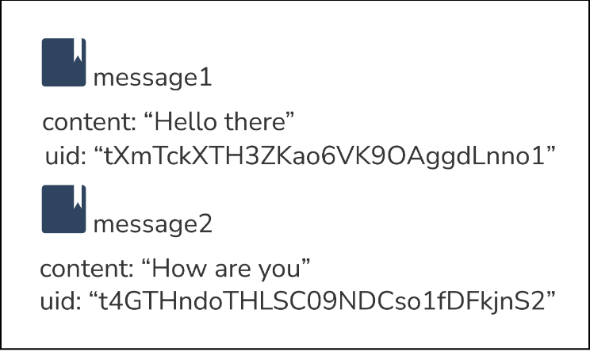
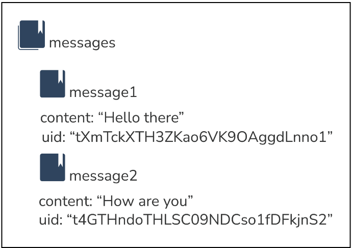
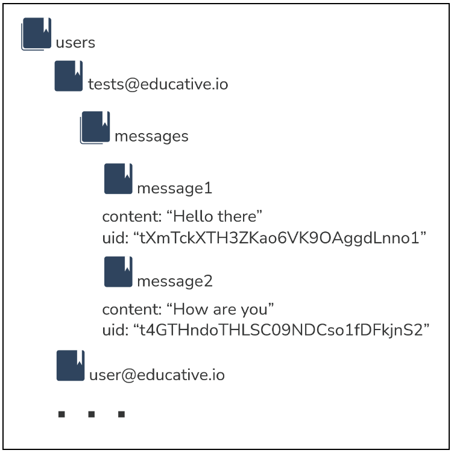

# understanding the cloud firestore structure

## the cloud firestore data model
uses hierarchical data structure to store data

### documents
a lightweight unit of storage made up of a set of key-value pairs

must be identified by a name or unique identifier
- we can allow cloud firestore to provide one automatically

supports various data types

typically looks like JSON
- can be treated as lightweight JSON records



### collections
a container for documents

organizes data and helps build efficient queries

*documents live inside collections
- messages collection (contains messages of a particular chat)
    - the messages are the documents

CAN ONLY CONTAIN DOCUMENTS



### subcollections
a collection associated with a specific document
- allows the hierarchical structure of data
    - makes data easier to access
- nested data (only up to 100 levels deep)

CAN ONLY CONTAIN DOCUMENTS AND OTHER SUBCOLLECTIONS



## cloud firestore references
**database reference -** a lightweight object that points to a location or path on the database

- documents and collections are uniquely identified by its location in the database

**creating a collection reference:**

1. use the collection function imported from the firebase/firestore subpackage

    a. takes a reference to the cloud firestore instance as first argument

    b. takes the collection path as second argument

***useful for querying documents in a collection**

```
import { collection, getFirestore } from "firebase/firestore";

const firestore = getFirestore();

// users collection reference
const usersRef = collection(firestore, "users");
```

**creating a document reference:**

1. use the doc function imported from the firebase/firestore subpackage

    a. takes a reference to the cloud firestore instance as first argument

    b. takes the slash-separated path to an individual document as second argument

```
import { doc, getFirestore } from "firebase/firestore";

const firestore = getFirestore();

// Educative document reference
const educativeRef = doc(firestore, "users/test@educative.io");
```

**creating a subcollection reference:**

1. use the collection function imported from the firebase/firestore subpackage

    a. takes a reference to the cloud firestore instance as first argument

    b. takes the slash-separated path to the collection location as second argument

```
import { collection, getFirestore } from "firebase/firestore";

const firestore = getFirestore();

// messages subcollection reference
const messagesRef = collection(firestore, "users/test@educative.io/messages");
```

**creating a reference to read or write to a document within a subcollection:**
- use the doc function
- reference points to message1 document within the messages subcollection

```
import { doc, getFirestore } from "firebase/firestore";

const firestore = getFirestore();

// message document reference
const messageRef = doc(firestore, "users/test@educative.io/messages/message1");
```

***The first path in the database must be a collection, followed by a document, then a collection, and so on.**

DOCUMENTS AND COLLECTIONS IN CLOUD FIRESTORE MUST ALWAYS FOLLOW THIS PATTERN

```
// we can also use relative paths to reference the firestore instance

import { doc, getFirestore } from "firebase/firestore";

const firestore = getFirestore();

// Educative document reference
const educativeRef = doc(firestore, "users/test@educative.io");

// message document reference
const messageRef = doc(educativeRef, "messages/message1");

// the messageRef above equals "users/test@educative.io/messages/message1"
```

## comparison with the realtime database
we can use either databases or use both on a single firebase app or project
- better to pick one that is best suited for the app

**both:** 
- flexible
- realtime
- providing NoSQL databases with offline support

**realtime database:**
- data is stored as a giant JSON tree
- only supports deep querying with limited sorting and filtering capabilities
- scales automatically to support 200,000 concurrent connections and 1,000 writes per second

**cloud firestore:** 
- data is stored as collections of documents
- cloud supports shallow querying with more powerful sorting and filtering functionalities
- scales automatically to support about 1 million concurrent connections and 10,000 writes per second