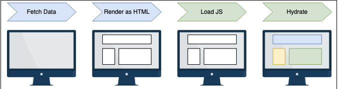

# server-side rendering (ssr)
*most common way of serving web pages (renders the html on the server before sending it to the browser)
- makes the markup dynamic once all the javascript content has been loaded

next.js does this same thing by rendering an html page on the server for each request, then sending it to the web browser (also injects its scripts to make the server-side rendered pages dynamic in a process called hydration)

***usage example:** building a blog that displays all the articles written by a specific author on a single page (single-page app aka spa)

## advantages of ssr
**more secure web apps:** managing cookies, calling private apis, and data validation won't be exposed to the client

**more compatible websites:** the website will be available even if the user has disabled javascript or uses an older browser

**enhanced search engine optimization:** since the client will receive the html content as soon as the server renders and sends it, the search engine spiders (bots that crawl the web pages) will not need to wait for the page to be rendered on the client side
- this will improve our web app's seo score!

## limitations of ssr
ssr requires us to deploy our web app to a server that will render a page as soon as it's required

with both csr and ssg, we can deploy static html files to any cloud provider, such as vercel or netlify for free (or at meager cost)

if we are already deploying our web app to a custom server, the ssr app will always lead to a more significant server workload and maintenance costs



with ssr, we are adding some latency to each request
- our pages might need to call some external api or data source and call this for every page render
    - this causes slower navigation between pages in comparison to client-side rendered or statically served pages

*a next.js page is statically generated at build time by default
- to make it more dynamic, we will need to export a function from our page

```
function IndexPage() {
  return <div>This is the index page.</div>;
}
export default IndexPage;
```

this index page only prints the "This is the index page." text inside a div
- doesn't call external apis or any other data source to work
- content will always be the same for each request

if we wanted to greet a user on every request, we will need to call a rest api on the server to get some specific user info to pass the result to the client using the next.js flow
- we use the getServerSideProps function

```
export async function getServerSideProps() {
  const userRequest = await fetch("https://example.com/api/user");
  const userData = await userRequest.json();

  return {
    props: { user: userData },
  };
}

function IndexPage(props) {
  return <div>Welcome, {props.user.name}!</div>;
}

export default IndexPage;
```

## code explanation
**line 1:** 
- export the async function getServerSideProps
- all the code within the scope of this function will always be executed on the server side

**lines 2-8:**
- we return an object containing a property called props (required)
    - the props will be injected inside our page component (makes them available on the client and server side)

**lines 10-12:**
- we refactor the IndexPage function
    - accepts a props parameter containing all the props passed from the getServerSideProps function

*when this code runs, next.js will dynamically render our IndexPage on the server, calling an external api and showing different results as soon as we make changes in our data source

## using browser apis with ssr
ssr has some caveats
- if we want to use any component that relies on browser-specific apis, we will need to render it on the browser explicitly (next.js renders the entire page content on the server by default)
    - DOES NOT expose certain apis (window or document)

----------------------------------------------------------------------
# EXAMPLE

**server-side blog rendering:**

```
import axios from 'axios';
import Link from 'next/link';
export default function ServerBlogPosts({ posts }) {
  return (
    <div>
      <div>
        <Link href="/serverPosts"> View Server blog posts </Link>
        <br/>
        <Link href="/clientPosts"> View Client blog posts </Link>
      </div>
      <h1>Server Blog Posts</h1>
      <ul>
        {posts.map((post) => (
          <li key={post.id}>{post.title}</li>
        ))}
      </ul>
    </div>
  );
}

export async function getServerSideProps() {
  const response = await axios.get('https://ed-6555414034513920.educative.run:3000/api/posts');
  const posts = response.data;
  return {
    props: {
      posts,
    },
  };
}
```