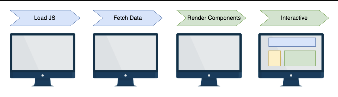

# client-side rendering (csr)
react apps are rendered once the javascript bundle has been transferred from the server to the client 
- when using create-react-app, the whole web page is entirely white before the app renders
    - this is because the server only serves a very basic html markup containing all the required scripts and styles to make our web app dynamic


**html generated cra:**
```
<!DOCTYPE html>
<html lang="en">
   <head>
      <meta charset="utf-8" />
      <link rel="icon" href="%PUBLIC_URL%/favicon.ico" />
      <meta name="viewport" content="width=device-width, initial-scale=1" />
      <meta name="theme-color" content="#000000" />
      <meta name="description" content="Web site created using create-react-app" />
      <link rel="apple-touch-icon" href="%PUBLIC_URL%/logo192.png" />
      <link rel="manifest" href="%PUBLIC_URL%/manifest.json" />
      <title>React App</title>
   </head>
   <body>
      <noscript>
         We need to enable JavaScript to run this app.
      </noscript>
      <div id="root"></div>
   </body>
</html>
```

there is only one div tag inside the body tag
- during the build, the compiled javascript and css files are injected into this html page
- the root div is used as a target container for rendering the whole app

once we publich the app, the first time we call the desired url, our browser will first render the preceding html
- once that is rendered, the script and link tags contained in the preceding markup will be injected and the browser will render the whole app, making it available for user interaction

## advantages of csr
**it makes our app feel like a native app:** every page of our web app is already downloaded in our browser
- we navigate to different pages by swapping the page content instead of downloading new content from the server (don't need to refresh the page to update content)

**page transitions made easy:** client-side navigation allows us to switch from one page to another without reloading the browser window
- comes in handy when we want to show some cool transitions between pages with ease (don't have any reload that might interrupt animations)

**lazy loading and performance:** the browser will only render the minimum html markup required for the web app to work
- if we habe a modal that appears once the user clicks on a button, its html markup is ot present on the html page until the button click event occurs

**less server-side workload:** the whole rendering phase is delegated to the browser
- the server only needs to send a very basic html page to the client (don't need a powerful server)



## improving performance and seo
if the user's internet connection is slow, the downloading of javascript and css files will take some time to complete
- this leaves the user waiting with an empty screen for several moments
- this also affects our web app seo score (search engine spiders will find our page empty)
    - google bots will give us a low-performance score to our website because of their waiting time for the javascript bundle to be transferred

by default, next.js renders all the react components inside a given page on the server side or at build time (doesn't expose specific apis or html elements)
- if we try to render any component that needs access to these apis, the rendering process will crash

***next.js demands the rendering of specific componentns to the browser**

## using the React.useEffect hook
**lets us perform side effects:** such as data fetching and manual dom changes **inside our function components, and it will do it after the component has been mounted**
- next.js will run the useEffect callback on the browser after react hydration, letting us perform certain actions only on the client side

**here is an example of displaying a code snipped on a web page to highlight and make the code more readable**

```
import Head from "next/head";
import hljs from "highlight.js";
import javascript from "highlight.js/lib/languages/javascript";
function Highlight({ code }) {
  hljs.registerLanguage("javascript", javascript);
  hljs.initHighlighting();
  return (
    <>
      <Head>
        <link rel="stylesheet" href="/highlight.css" />
      </Head>
      <pre>
        <code className="js">{code}</code>
      </pre>
    </>
  );
}
export default Highlight;
```

this would run perfectly on a csr app, but would crash during the rendering or build phase on next.js
- Highlight.js needs the document global variable (does not exist in node.js because it is exposed by browsers only)

**we fix this by wrapping all the hljs calls in the useEffect hook:**

```
import { useEffect } from "react";
import Head from "next/head";
import hljs from "highlight.js";
import javascript from "highlight.js/lib/languages/javascript";
function Highlight({ code }) {
  useEffect(() => {
    hljs.registerLanguage("javascript", javascript);
    hljs.initHighlighting();
  }, []);
  return (
    <>
      <Head>
        <link rel="stylesheet" href="/highlight.css" />
      </Head>
      <pre>
        <code className="js">{code}</code>
      </pre>
    </>
  );
}
export default Highlight;
```

next.js will render the html markup returned by our component, inject the Highlight.js script into our page, and once the component is mounted on the browser, it will call the library funcions on the client side

**we can also use the exact appproach for rendering a component exclusively on the client side by using React.useEffect and React.useState together:**

```
import { useEffect, useState } from "react";
import Highlight from "../components/Highlight";
function UseEffectPage() {
  const [isClient, setIsClient] = useState(false);
  useEffect(() => {
    setIsClient(true);
  }, []);
  return (
    <div>
      {isClient && (
        <Highlight code={"console.log('Hello, world!')"} language="js" />
      )}
    </div>
  );
}
export default UseEffectPage;
```

this component can be rendered on the browser exclusively 

## using the process.browser variable
we can also use browser-specific apis to conditionally execute scripts and components depending on the process.browser global variable

next.js appends this incredibly useful property to node.js's process object
- it is a boolean value set to true when the code runs on the client side and false when running on the server side

```
function IndexPage() {
  const side = process.browser ? "client" : "server";
  return <div> We are currently on the {side}-side.</div>;
}
export default IndexPage;
```

when running this, the browser will briefly show the following text: "You're currently on the server-side"
- this will be replaced by the "You're currently running on the client-side" text as soon as react hydration occurs

## using dynamic component loading 
next.js extends react functionalities by adding some great built-in components and utility functions
- dynamic is one of the most interesting modules provided by the framework

**here is another way to render the Highlight.js component using the next.js dynamic function:**

```
import dynamic from 'next/dynamic';
const Highlight = dynamic(
    () => import('../components/Highlight'),
    { ssr: false }
);
import styles from '../styles/Home.module.css';
function DynamicPage() {
  return (
  <div className={styles.main}>
    <Highlight code={"console.log('Hello, world!')"} language='js'/>
  </div>
  );
}
export default DynamicPage;
```

we import our Highlight component via dynamic imports
- we want it to be executed on the client only (ssr: false)
    - next.js won't try to render that component on the server and we will have to wait for react hydration to make it available on the browser

## conclusion
csr can be a great alternative to ssr for building very dynamic web pages

if we are working on a page that doesn't need to be indexed by search engines, it could make sense to first load our app's javascript and then, from the client side, fetch any necessary data from the server
- this would lighten the server-side workload since this approach doesn't involve ssr and our app could scale better

----------------------------------------------------------------------
# EXAMPLE

**client-side blog rendering:**

```
import React, { useState, useEffect } from "react";
import Link from 'next/link';

export default function ClientBlogPost() {
  const [clientBlogPosts, setClientPosts] = useState([]);

  useEffect(() => {
    async function fetchClientBlogs() {
      try {
        const response = await fetch("https://ed-6555414034513920.educative.run:3000/api/posts");
        const data = await response.json();
        setClientPosts(data);
      } catch (error) {
        console.error("Error fetching data:", error);
      }
    }

    fetchClientBlogs();
  }, []);

  return (
    <div>
      <div>
        <Link href="/serverPosts"> View Server blog posts </Link>
        <br/>
        <Link href="/clientPosts"> View Client blog posts </Link>
      </div>
      <h1>Client Blog Posts</h1>
      <ul>
        {clientBlogPosts.map((clientBlogPost) => (
          <li key={clientBlogPost.id}>{clientBlogPost.title}</li>
        ))}
      </ul>
    </div>
  );
}
```